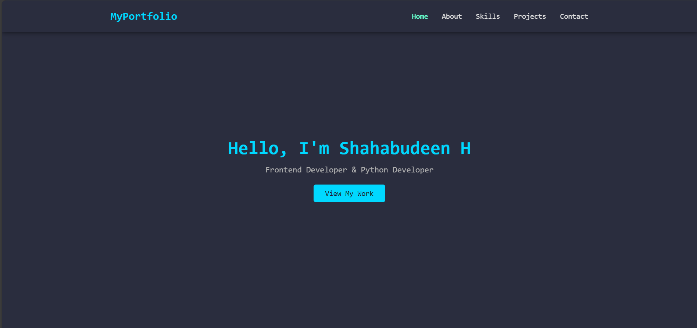
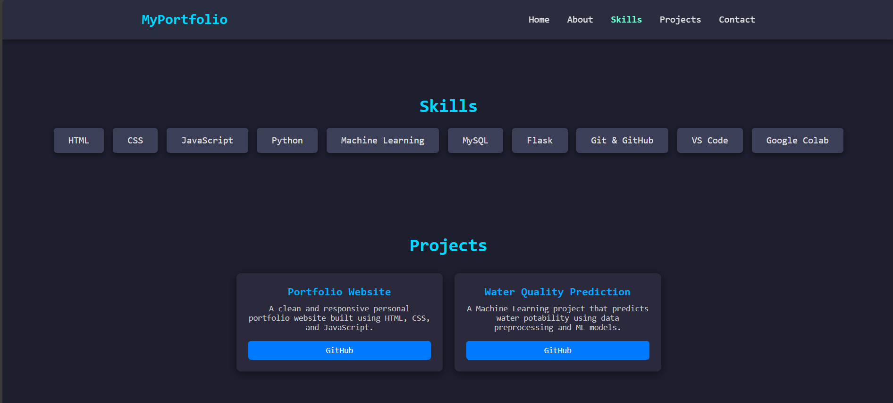

# My Portfolio  
End-to-end personal portfolio website: showcases skills, projects & contact form for connecting with me.  

💻 **Frontend & Python Developer Portfolio**  
This project is a clean, responsive, and interactive portfolio website built using HTML, CSS, JavaScript, and Python (Flask-ready). It highlights my skills, projects, and provides a contact form for visitors to reach out.  

---

## 🌐 Live Demo
[](https://shahabudeen-h.github.io/my-portfolio/)

---

## 🚀 Features
- Responsive design for desktop, tablet, and mobile devices  
- Smooth scrolling and scroll reveal animations  
- Contact form with popup confirmation and optional sound notification  
- Projects showcase with GitHub links  
- Mobile-friendly navigation with hamburger menu  
- Clean and professional UI/UX  

---

## ⚙️ Tech Stack
  
  
  

- **Frontend:** HTML, CSS, JavaScript  
- **Other Tools:** Git & GitHub, VS Code, Google Colab  

---

## 📂 Project Structure

my-portfolio/
├─ index.html # Main portfolio page
├─ style.css # Styles for all sections
├─ script.js # JS for smooth scroll, navbar, form popup
├─ assets/
│ ├─ new-notification-010-352755.mp3 # Popup sound
│ └─ images/ images/screenshots
├─ README.md # This file
└─ LICENSE # MIT License


---

## 🔧 Setup & Installation
Clone the repository:
```bash
git clone https://github.com/shahabudeen-h/my-portfolio.git
cd my-portfolio

Open index.html in any modern browser to view the portfolio.
No server setup required for frontend-only version.

🧠 How it works

index.html contains all sections: Home, About, Skills, Projects, Contact

style.css handles design, responsive layout, and animations

script.js manages:

Smooth scroll navigation

Scroll reveal animations

Mobile hamburger menu toggle

Contact form AJAX submission & success popup with sound

🖼 Screenshots





👤 Author

Shahabudeen H — MCA Graduate | Frontend & Python Developer

GitHub: github.com/shahabudeen-h

LinkedIn: linkedin.com/in/shahabudeen-h-389597326

📄 License

This project is licensed under the MIT License. See the LICENSE
 file for details.
